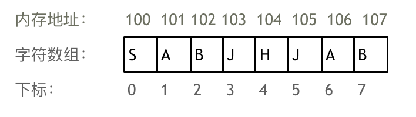
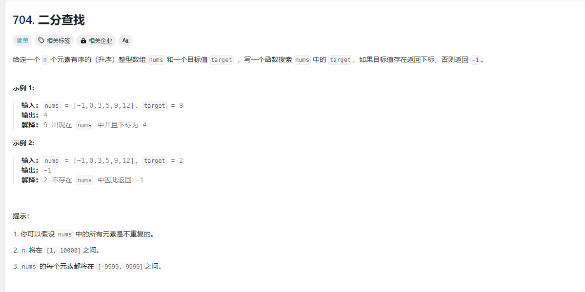
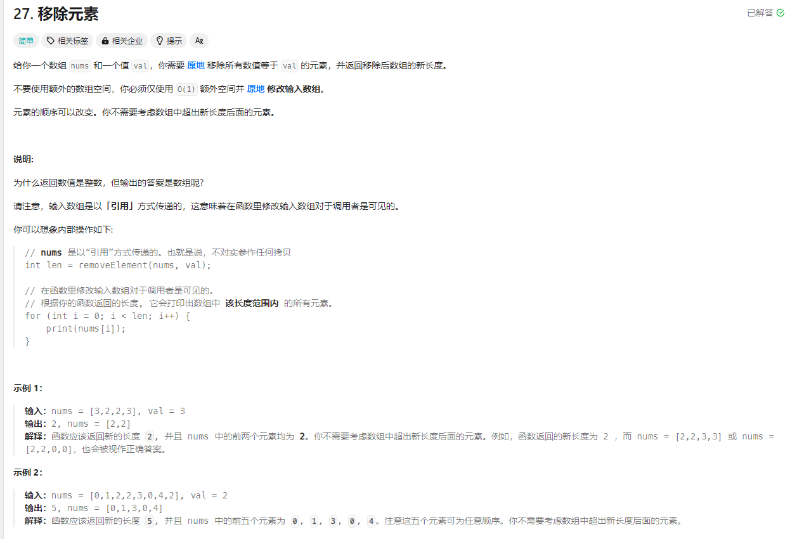

# 代码随想录训练营-Day01

## 数组

**数组是存放在连续内存空间上的相同类型数据的集合**，可以方便的通过下标索引的方式获取到下标下对应的数据



## LeetCode题目

### 704.二分查找

题目来源：[704. 二分查找](https://leetcode.cn/problems/binary-search/)

题目截图如下：



#### 题解：

##### 1.左闭右开区间法[left, right]

****

- while (left <= right)
- if (nums[middle] > target) right 要赋值为 middle - 1，区间左移
- if (nums[middle] < target) left 要赋值为 middle +1， 区间右移
- if (nums[middle] == target) 为目标

代码如下：

```go
func search(nums []int, target int) int {
	left := 0
	right := len(nums) - 1
	for left <= right {
		middle := left + (right-left)/2
		if nums[middle] > target {
			// 进入左区间
			right = middle - 1
		} else if nums[middle] < target {
			// 进入右区间
			left = middle + 1
		} else {
			return middle
		}
	}
	return -1
}
```

注意点： right 的启始位置是 len(nums)-1

##### 2.左闭右开区间法**[left, right）**

- while (left < right)
- if (nums[middle] > target) right 要赋值为 middle ，区间左移
- if (nums[middle] < target) left 要赋值为 middle +1， 区间右移
- if (nums[middle] == target) 为目标

代码如下：

```go
func search(nums []int, target int) int {
	left := 0
	right := len(nums)
	for left < right {
		middle := left + (right-left)/2
		if nums[middle] > target {
			right = middle
		} else if nums[middle] < target {
			left = middle + 1
		} else {
			return middle
		}
	}
	return -1
}
```

注意点： right 的启始位置是 len(nums)


#### 代码与测试用例

[完整代码实现](https://github.com/dadaxiaoxiao/CodeRandomizerNote-/blob/main/leetcodeCode/leetcode0704/binary_search.go)

[测试用例](https://github.com/dadaxiaoxiao/CodeRandomizerNote-/blob/main/leetcodeCode/leetcode0704/binary_search_test.go)


###  **27. 移除元素**

题目来源：[27. 移除元素](https://leetcode.cn/problems/remove-element/)




#### 题解：

##### **双指针法（快慢指针法）**

**在数组和链表的操作中是非常常见的，很多考察数组、链表、字符串等操作的面试题，都使用双指针法。**

- 快指针负责循环数组
- 判断当前快指针下对应的数组 != target 成立
  - num[慢指针] = num[快指针]
  - 慢指针指向下一位

代码实现：

```go
// removeElement 移除元素
// 这里使用双指针，并对 nums 进行了缩容
func removeElement(nums []int, val int) int {
	res := 0
	length := len(nums)
	for i := 0; i < length; i++ {
		if nums[i] != val {
			nums[res] = nums[i]
			res++
		}
	}
	nums = nums[:res]
	return res
}
```

#### 代码与测试用例

[完整代码实现](https://github.com/dadaxiaoxiao/CodeRandomizerNote-/blob/main/leetcodeCode/leetcode0027/removeElement.go)

[测试用例](https://github.com/dadaxiaoxiao/CodeRandomizerNote-/blob/main/leetcodeCode/leetcode0027/removeElement_test.go)