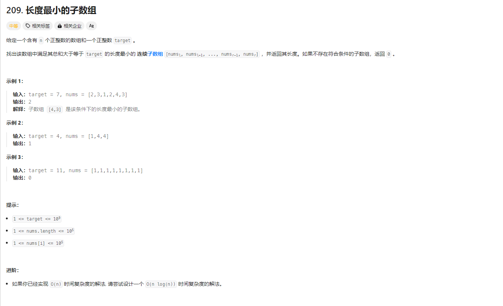
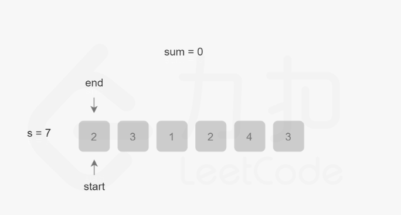
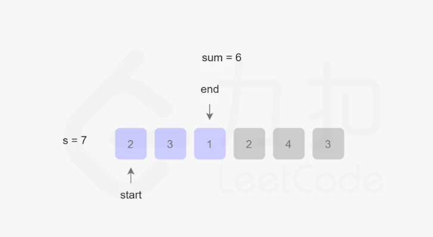
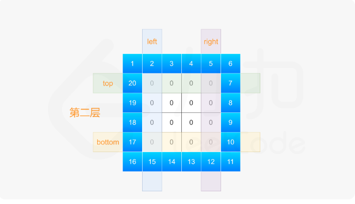

# 代码随想录训练营-Day02 

## LeetCode题目

### 977.有序数组的平方 

题目来源：[977.有序数组的平方](https://leetcode.cn/problems/squares-of-a-sorted-array/description/)

力扣题目截图：


#### 题解：

这里要求时间复杂度为O(n),所以使用双指针法，只需要一个for 循环下完成。

双指针法（快慢指针法）：**通过一个快指针和慢指针在一个for循环下完成两个for循环的工作。**

因为数组是非递减顺序排序的数组，所以存在负数的情况。

一个指针从左到右边，一个指针从右边到左边。每次比较两个指针对应的数平方大小，大的存入结果数组并移动指针，小的停在原地

代码如下：

```go
// sortedSquares
// leetcode997 有序数组的平方
// 这里使用了双指针的思想
func sortedSquares(nums []int) []int {
	length := len(nums)
	res := make([]int, length)
	left, right, k := 0, length-1, length-1
	for left <= right {
		if nums[left]*nums[left] < nums[right]*nums[right] {
			res[k] = nums[right] * nums[right]
			// right 指针前移动
			right--
		} else {
			res[k] = nums[left] * nums[left]
			// left 指针后移动
			left++
		}
		k--
	}
	return res
}

```

#### 代码与测试用例

[完整代码实现](https://github.com/dadaxiaoxiao/CodeRandomizerNote-/blob/main/leetcodeCode/leetcode0977/sortedSquares.go)

[测试用例](https://github.com/dadaxiaoxiao/CodeRandomizerNote-/blob/main/leetcodeCode/leetcode0977/sortedSquares_test.go)


### 209.长度最小的子数组

题目来源：[209.长度最小的子数组](https://leetcode.cn/problems/minimum-size-subarray-sum/description/)

力扣题目截图：



#### 题解：

这里要求时间复杂度为O(n),同样也是使用双指针法，但是这次是滑动窗口法。

- 定义两个指针 start 和end 分别表示子数组（滑动窗口窗口）的开始和结束位置（都从0开始），维护变量sum 存储子数组中的元素和（从nums[start]到nums[end] 的总和）
- 每一轮迭代，nums[end] 追加到 sun ,如果sum>target
  - 则更新子数组的最小长度, end-start+1 ( 同样更新子数组的最小长度)
  - 然后将nums[start]  从 sum 中减去并将start 右移动，直到 sum <target
- end 指针右移动

[题解图来自](https://leetcode.cn/problems/minimum-size-subarray-sum/solutions/305704/chang-du-zui-xiao-de-zi-shu-zu-by-leetcode-solutio/)






代码如下：

```go
// minSubArrayLen
// leetcode 209 取长度最小的子数组
func minSubArrayLen(target int, nums []int) int {
	n := len(nums)
	if n == 0 {
		return 0
	}

	// 快慢双指针
	l, r := 0, 0
	// 当前最小长度
	length := math.MaxInt
	// 总数
	sum := 0

	for r < n {
		sum += nums[r]
		for sum >= target {
			length = min(length, r-l+1)
			// 减去慢指针的对应的值，并慢指针后移
			sum -= nums[l]
			l++
		}
		// 快指针后移
		r++
	}
	if length == math.MaxInt {
		return 0
	}
	return length
}

// min 取两者最小值
func min(a, b int) int {
	if a < b {
		return a
	} else {
		return b
	}
}
```


**滑动窗口的精妙之处在于根据当前子序列和大小的情况，不断调节子序列的起始位置。从而将O(n^2)的暴力解法降为O(n)。**


#### 代码与测试用例

[完整代码实现](https://github.com/dadaxiaoxiao/CodeRandomizerNote-/blob/main/leetcodeCode/leetcode0209/minSubArrayLen.go)

[测试用例](leetcodeCode/leetcode0209/minSubArrayLen_test.go)

### 59.螺旋矩阵I

题目来源：[59.螺旋矩阵I](https://leetcode.cn/problems/spiral-matrix-ii/submissions/524745088/)

力扣题目截图：


#### 题解：


对于每层，从左上方开始以顺时针的顺序填入所有元素。假设当前层的左上角位于 (top,left)，右下角位于 (bottom,right)，按照如下顺序填入当前层的元素。

- left< = right && top <= bottom
- 从左到右填入上侧元素,依次为（top,left) 到（top,right)
- 从上到下填入右侧元素 (top+1,right) 到 （bottom ,right)
- 判读 left< = right && top <= bottom
  - 则从右到左填入下侧元素，依次为（bottom,right-1) 到（bottom,*left*+1)
  - 下到上填入左侧元素,依次为(bottom,left) 到 （top+1,left)

[题解图来自](https://leetcode.cn/problems/spiral-matrix-ii/solutions/658676/luo-xuan-ju-zhen-ii-by-leetcode-solution-f7fp/)





代码如下：

```go
// generateMatrix
// leetcode59 螺旋矩阵 II
func generateMatrix(n int) [][]int {
	matrix := make([][]int, n)
	for i := range matrix {
		matrix[i] = make([]int, n)
	}

	num := 1
	top, left, bottom, right := 0, 0, n-1, n-1
	for left <= right && top <= bottom {
		// top  left > right
		for column := left; column <= right; column++ {
			matrix[top][column] = num
			num++
		}
		top++

		// right top > bottom
		for row := top; row <= bottom; row++ {
			matrix[row][right] = num
			num++
		}
		right--

		if left <= right && top <= bottom {
			// bottom right > left
			for column := right; column >= left; column-- {
				matrix[bottom][column] = num
				num++
			}
			bottom--

			// left  bottom > top
			for row := bottom; row >= top; row-- {
				matrix[row][left] = num
				num++
			}
			left++
		}
	}
	return matrix
}

```

#### 代码与测试用例

[完整代码实现](https://github.com/dadaxiaoxiao/CodeRandomizerNote-/blob/main/leetcodeCode/leetcode0059/generateMatrix.go)

[测试用例](https://github.com/dadaxiaoxiao/CodeRandomizerNote-/blob/main/leetcodeCode/leetcode0059/generateMatrix_test.go)