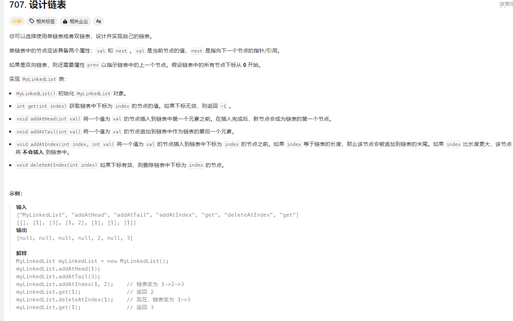

# 代码随想录训练营-Day03

## 链表相关概念

链表是一种通过指针串联在一起的线性结构，每一个节点由两部分组成，一个是数据域一个是指针域（存放指向下一个节点的指针），最后一个节点的指针域指向null

### 链表的类型

### 1.单链表


### 2.双链表


### 3.循环链表


### 链表的存储方式

但是链表在内存中不是连续分布的，链表是通过指针域的指针链接在内存中各个节点。


### 链表vs数组性能


## LeetCode题目

### **203.移除链表元素** 

题目来源：[203.移除链表元素](https://leetcode.cn/problems/remove-linked-list-elements/description/)

题目截图如下：


题解：


1.使用虚拟头节点，指针域指头节点，来进行统一的删除规则。（避免当删除的是头节点这种特殊情况处理,这样的做法是，current 节点判断下一个节点）

2.使用 current 指针来遍历链表（为什么不使用虚拟头节点？这个需要返回）

3.循环条件是 current ！= nil && current.next != nil 

为什么 ？ 因为 dummynode > 1 > null 这种情况是，current = dummynode  ,current.next = 1

实现代码：

```go
func removeElements(head *ListNode, val int) *ListNode {
	// 新建虚拟头节点
	dummyNode := &ListNode{}
	// 为了避免删除头节点的情况，这里使用统一的删除规则
	dummyNode.Next = head
	// 新建 cur 暂存节点用来遍历
	cur := dummyNode

	for cur != nil && cur.Next != nil {
		if cur.Next.Val == val {
			// 变更当前指针的指针域
			cur.Next = cur.Next.Next
		} else {
			// 当前指针指向下一个
			cur = cur.Next
		}
	}
	return dummyNode.Next
}
```

[完整实现代码](https://github.com/dadaxiaoxiao/CodeRandomizerNote-/blob/main/leetcodeCode/leetcode0203/removeElements.go)

[测试用例](https://github.com/dadaxiaoxiao/CodeRandomizerNote-/blob/main/leetcodeCode/leetcode0203/removeElements_test.go)


### **707.设计链表** 

题目来源：

题目来源：[707.设计链表](https://leetcode.cn/problems/design-linked-list/description/)

题目截图如下：



题解：

待完成

实现代码：

```go
// ListNode 指针
type ListNode struct {
	Val  int
	Next *ListNode
}

type MyLinkedList struct {
	head *ListNode
	// 记录链表长度
	Size int
}

func Constructor() MyLinkedList {
	//哨兵节点作为头节点(虚拟头节点)
	return MyLinkedList{&ListNode{}, 0}
}

func (this *MyLinkedList) Get(index int) int {
	// 无效索引
	if index < 0 || index >= this.Size {
		return -1
	}
	// current 等于真正头节点
	cur := this.head.Next
	for i := 0; i < index; i++ {
		cur = cur.Next // 遍历到索引所在的节点
	}
	return cur.Val
}

func (this *MyLinkedList) AddAtHead(val int) {
	this.AddAtIndex(0, val)
}

func (this *MyLinkedList) AddAtTail(val int) {
	this.AddAtIndex(this.Size, val)
}

func (this *MyLinkedList) AddAtIndex(index int, val int) {
	// 题目要求
	// index 等于链表的长度，那么该节点会被追加到链表的末尾
	// index 大于链表的长度，该节点不会插入链表中
	// 所以 index 小于 0，这里应该默认index =0
	if index < 0 {
		index = 0
	} else if index > this.Size {
		return
	}

	newNode := &ListNode{Val: val} // 创建新节点
	cur := this.head               // 创建cur 遍历链表
	for i := 0; i < index; i++ {   // 遍历到指定索引的前一个节点
		cur = cur.Next
	}
	newNode.Next = cur.Next // 新节点指向原索引节点
	cur.Next = newNode      // 原索引的前一个节点指向新节点
	this.Size++             // 链表大小增加1
}

func (this *MyLinkedList) DeleteAtIndex(index int) {
	if index < 0 || index >= this.Size {
		return
	}

	cur := this.head             // 创建cur 遍历链表
	for i := 0; i < index; i++ { // 遍历到指定索引的前一个节点
		cur = cur.Next
	}
	cur.Next = cur.Next.Next

	this.Size-- // 链表大小减一

}
```

[完整实现代码](https://github.com/dadaxiaoxiao/CodeRandomizerNote-/blob/main/leetcodeCode/leetcode0707/mylinkedlist.go)


###  **206.反转链表** 

题目来源：[206.反转链表](https://leetcode.cn/problems/reverse-linked-list/description/)

题目截图如下：


#### 题解

#### 1.双指针法：

- 新建pre 链表来记录反转后的链表
- 新建current 链表 暂存节点用来遍历
- 注意这里的循环判断条件是  current  ！=nil
-  current的指针域 反转指向 pre
- 最后先移动pre，再移动current


#### 2.递归方法：


 pre 链表来记录反转后的链表，head 是传入的头指针链表

 reverse(pre, head *ListNode) 最核心的方法是 链表反转

递归结束的判断条件 是 head == nil , 返回 pre

然后 pre , head 先后移动


实现代码：

```go

type ListNode struct {
	Val  int
	Next *ListNode
}

// reverseList
// 链表反转
// 这里使用 cur ,pre 双指针法
func reverseList(head *ListNode) *ListNode {
	var pre *ListNode
	// 新建 cur 暂存节点用来遍历
	cur := head
	for cur != nil {
		// 下一个节点
		next := cur.Next
		// 指针域反转
		cur.Next = pre
		// 先移动 pre,后移动cur
		pre = cur
		cur = next
	}
	return pre
}

// reverseList
// 链表反转
// 这里使用递归
func reverseList(head *ListNode) *ListNode {
	return reverse(nil, head)
}

func reverse(pre, head *ListNode) *ListNode {
	if head == nil {
		return pre
	}
	// 下一个指针节点
	next := head.Next
	// 指针域反转
	head.Next = pre

	// pre = head  head = next
	return reverse(head, next)
}
```

[完整实现代码](https://github.com/dadaxiaoxiao/CodeRandomizerNote-/blob/main/leetcodeCode/leetcode0206/reverselist.go)

[测试用例](https://github.com/dadaxiaoxiao/CodeRandomizerNote-/blob/main/leetcodeCode/leetcode0206/reverseList_test.go)