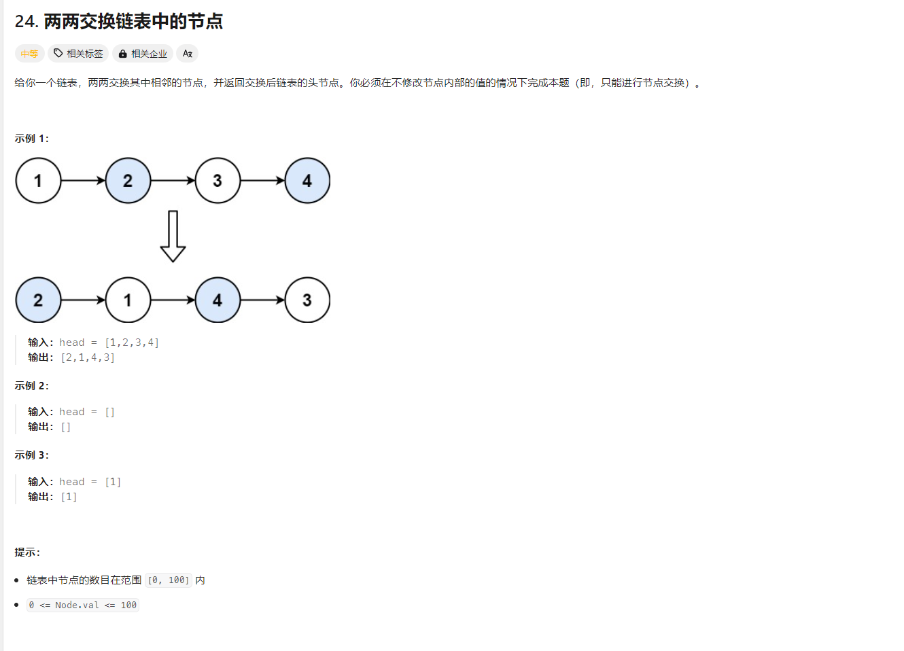
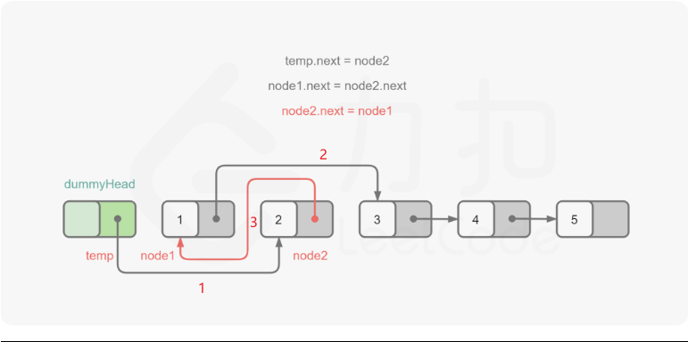
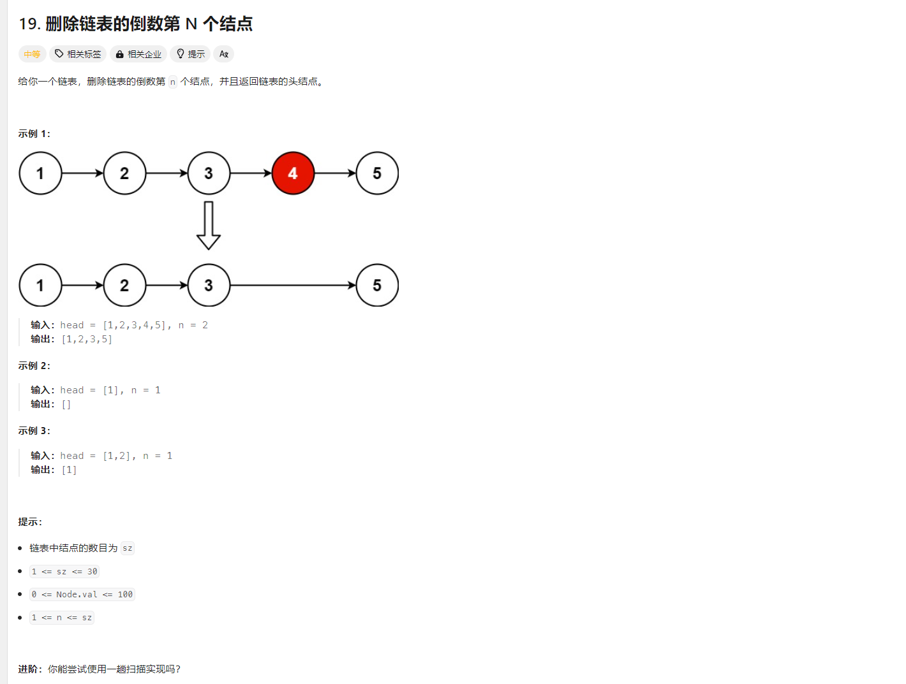
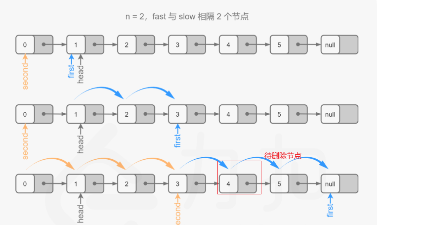
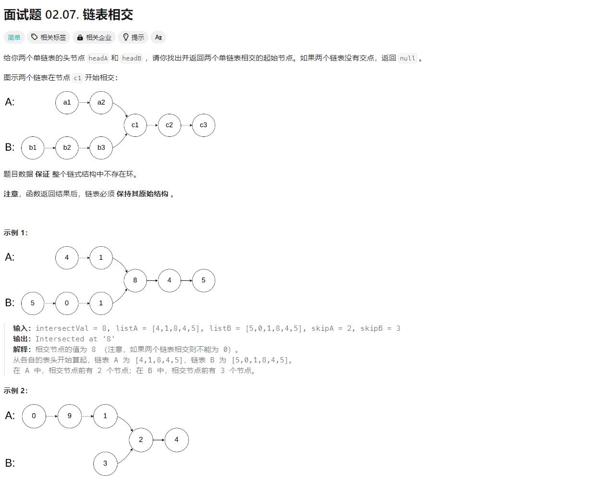
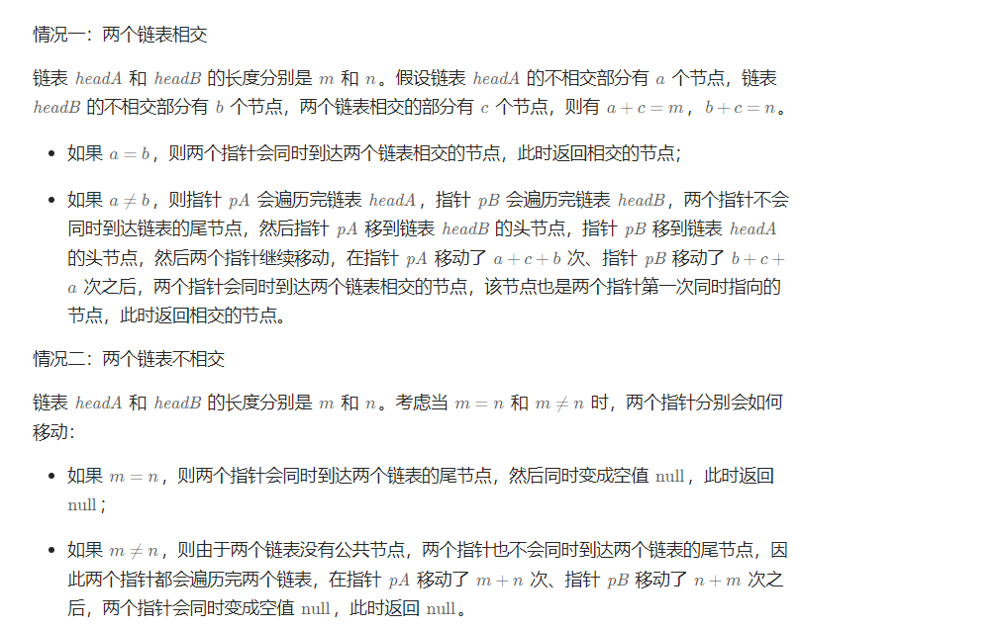

# 代码随想录训练营-Day04


## LeetCode题目

### 24.两两交换链表中的节点

题目来源：[24. 两两交换链表中的节点](https://leetcode.cn/problems/swap-nodes-in-pairs/)

题目截图：





#### 题解：

创建哑结点 dummyHead  节点，进行统一的处理逻辑 current = dummyHead  ，判断下个节点，下下个节点

循环遍历的结束条件怎么取？因为链表数分奇偶数，偶数时 current.Next != nil     奇数为  current.Next.Next ！= nil ,所以   current.Next != nil   &&  current.Next.Next ！= nil 

两两交换逻辑



可以看得出 步骤1 后，dummyhead 与节点1 的链接就断了，无法找到 节点1 。需要先暂存 node1= current.next

步骤2后，节点1与节点2 的链接就断了，无法找到 节点2。需要先暂存 node2= current.next.next

此次兑换后便为 current -> 2->1->3, current 要变更为1

```
cur.Next = node2
node1.next = node2.next
node2.next = node1

curr = node1
```


代码实现

```go
type ListNode struct {
	Val  int
	Next *ListNode
}

// swapPairs
// leetcode2
// 两两交换链表中的节点
func swapPairs(head *ListNode) *ListNode {
	dummyHead := &ListNode{
		Val:  0,
		Next: head,
	}

	// 暂存节点用来遍历
	curr := dummyHead

	// 节点数目为偶数   curr.Next ！= nil
	// 节点数目为奇数   curr.Next.Next != nil
	for curr.Next != nil && curr.Next.Next != nil {
		node1 := curr.Next
		node2 := curr.Next.Next

		// 模拟相邻节点交换
		// temp -> node1 -> node2 交换 temp -> node2 -> node1
		curr.Next = node2
		node1.Next = node2.Next
		node2.Next = node1

		// 更新交换节点前一个
		curr = node1

	}
	return dummyHead.Next
}
```


[完整代码实现](https://github.com/dadaxiaoxiao/CodeRandomizerNote-/blob/main/leetcodeCode/leetcode0024/swappairs.go)

[测试用例](https://github.com/dadaxiaoxiao/CodeRandomizerNote-/blob/main/leetcodeCode/leetcode0024/swappairs_test.go)


### 19.删除链表的倒数第 N 个结点

题目来源：[19. 删除链表的倒数第 N 个结点](https://leetcode.cn/problems/remove-nth-node-from-end-of-list/)

题目截图：



#### 题解：

题目要求使用一遍扫描实现，那么可以使用快慢指针法。

因为有链表删除节点逻辑，为了避免删除节点为头节点的特殊情况，需要引用虚拟头节点 dummyHead,进而使用统一的删除规则

因为题目要求删除倒数第n 个节点。那么可以得出，快指针应该先走，当快指针与慢指针相隔n 个节点后， 快慢指针同时循环，但快指针指向nil 时，慢指针指向 **待删除节点的前一个位置**




low,fast ：=  dummyHead , dummyHead   fast 应该先走n+1 步

low，fast  = dummyHead ，head  fast 应该先走n 步

代码实现

```go
func removeNthFromEnd(head *ListNode, n int) *ListNode {
	dummyHead := &ListNode{Val: 0, Next: head}
	// 快指针比慢指针间隔n,但快指针指向nil时，慢指针指向倒数第n个元素的前一个
	low, fast := dummyHead, head
	for i := 0; i < n; i++ {
		fast = fast.Next
	}

	// 快指针,同时走
	for ; fast != nil; fast = fast.Next {
		low = low.Next
	}
	low.Next = low.Next.Next
	return dummyHead.Next
}
```

[完整实现代码](https://github.com/dadaxiaoxiao/CodeRandomizerNote-/blob/main/leetcodeCode/leetcode0019/removeNthFromEnd.go)

[测试用例](https://github.com/dadaxiaoxiao/CodeRandomizerNote-/blob/main/leetcodeCode/leetcode0019/removeNthFromEnd_test.go)


### 面试题02.07 链表相交

[面试题 02.07. 链表相交](https://leetcode.cn/problems/intersection-of-two-linked-lists-lcci/)



#### 题解：

使用双指针的方法，可以将空间复杂度降至 O(1)。




代码实现

```go
func getIntersectionNode(headA, headB *ListNode) *ListNode {
    if headA == nil || headB == nil {
        return nil
    }

    pa,pb := headA,headB
    for pa != pb {
        if pa == nil {
            pa = headB
        }else{
            pa = pa.Next
        }

        if pb == nil {
            pb = headA
        }else{
            pb = pb.Next
        }

    }
    return pa
}
```

[完整实现代码](https://github.com/dadaxiaoxiao/CodeRandomizerNote-/blob/main/leetcodeCode/leetcode_interview_question_0207/getIntersectionNode.go)