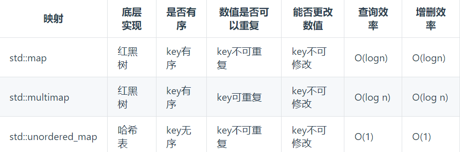

# 代码随想录训练营-Day06

 

## 哈希表相关知识



使用总结

**当我们遇到了要快速判断一个元素是否出现集合里的时候，就要考虑哈希法**。牺牲了空间换取时间。


## LeetCode题目

### 242.有效的字母异词

题目：[242. 有效的字母异位词](https://leetcode.cn/problems/valid-anagram/)

题目截图：


#### 题解：

t 是 s  的异位词等价于「两个字符串中字符出现的种类和次数均相等」，故  t ,s 的长度相等的

可以维护一个 hashtable  先遍历记录字符串 s 字符出现的频次 . hashtable key 为rune val int (Unicode 字符串为32 位小数)

后遍历字符串 t，减去hashtable   中对应的频次

如果出现 hashtable[key ] <0  则说明 t 包含一个不在 s 中的额外字符  (   t ,s 的长度相等,如果是异位词，每个  hashtable[key ] ==0  )，返回false

实现代码

```go

func isAnagram(s string, t string) bool {
	// 如果 s,t 互为字母异位词 ,那么两个长度一定相等
	if len(s) != len(t) {
		return false
	}

	cnt := make(map[rune]int)
	for _, ch := range s {
		cnt[ch]++
	}

	for _, ch := range t {
		cnt[ch]--
		if cnt[ch] < 0 {
			return false
		}
	}
	return true
}
```


[完整实现代码](https://github.com/dadaxiaoxiao/CodeRandomizerNote-/blob/main/leetcodeCode/leetcode0242/isanagram.go)


### **349. 两个数组的交集** 

题目：[349. 两个数组的交集](https://leetcode.cn/problems/intersection-of-two-arrays/)

题目截图


#### 题解：

题目要求求交集，可以可以理解为 nums2的每个元素，找 是否出现在 nums1 集合元素里面。可以用哈希法 时间复杂度 O(1),空间复杂度O(n)

可以得到的思路，nums1 的元素 存入hashtable(这里每个元素都是唯一的) ，遍历nums2 判断每个元素是否存入hashtable 

又因为题干要求 输出每个元素是唯一的 ,所以 当判定 nums2 的某个元素是存在hashtable 后，hashtable 同时要移除 key


实现代码：

```go
func intersection(nums1 []int, nums2 []int) []int {
	res := make([]int, 0)
	set := make(map[int]struct{}, 0)

	for _, v := range nums1 {
		if _, ok := set[v]; !ok {
			set[v] = struct{}{}
		}
	}
	for _, v := range nums2 {
		if _, ok := set[v]; ok {
			res = append(res, v)
			// 哈希表删除，下一次就会判断不存在，这里保证了唯一性
			delete(set, v)
		}
	}
	return res
}

```

or

```go
func intersection(nums1 []int, nums2 []int) []int {
	res := make([]int, 0)
	set := make(map[int]int, 0)

	for _, v := range nums1 {
		if _, ok := set[v]; !ok {
			set[v] = 1
		}
	}
	for _, v := range nums2 {
		if _, ok := set[v]; ok {
			res = append(res, v)
			// 哈希表删除，下一次就会判断不存在，这里保证了唯一性
			delete(set, v)
		}
	}
	return res
}
```

[完整实现代码](https://github.com/dadaxiaoxiao/CodeRandomizerNote-/blob/main/leetcodeCode/leetcode0349/intersection.go)


###  **202. 快乐数** 

题目：[202. 快乐数](https://leetcode.cn/problems/happy-number/)

题目截图


#### 题解：

题干说了会 **无限循环**，那么也就是说**求和的过程中，sum会重复出现**，**当我们遇到了要快速判断一个元素是否出现集合里的时候，就要考虑哈希法了。**

使用 hashtable  来存储  sum,key 为 sum = n ,value 为 ture

循环的结束条件是  n!= 1 && hashtable [n]  ,就是如题干描述的，n== 1 结束循环，或者存在循环  hashtable [n]  == true

n = 19 拆分为 1x1 + 9x9  得到 新的n = 82


实现代码：

```go
func isHappy(n int) bool {
	set := make(map[int]bool)
	// 循环跳出条件 n = 1 或者 无限循环（这里就是 set[n] == true, 哈希表存在元素）
	for n != 1 && !set[n] {
		n, set[n] = getSum(n), true
	}
	return n == 1
}

func getSum(n int) int {
	sum := 0
	// 每个数字的平方和
	for n > 0 {
		sum += (n % 10) * (n % 10)
		n = n / 10
	}
	return sum
}

```


[完整实现代码](https://github.com/dadaxiaoxiao/CodeRandomizerNote-/blob/main/leetcodeCode/leetcode0202/ishappy.go)


###  **1. 两数之和** 

题目：[1. 两数之和](https://leetcode.cn/problems/two-sum/)

题目截图：


#### 题解：

本质是  遍历枚举数组中的每一个数 `x`，寻找数组中是否存在 `target - x`

我们遇到了要快速判断一个元素是否出现集合里的时候，就要考虑哈希法了

因为 数组中同一个元素在答案里不能重复出现，所以使用hashtable 存储已经遍历过的 数组元素。当数组在遍历时，可以 从hashtable 查找是否存在 target - x


实现代码

```go
// twoSum
// leetcode 1. 两数之和
func twoSum(nums []int, target int) []int {
	hashtable := make(map[int]int)
	for index, v := range nums {
		if preIndex, ok := hashtable[target-v]; ok {
			return []int{preIndex, index}
		}
		hashtable[v] = index
	}
	return nil
}
```

[完整实现代码](https://github.com/dadaxiaoxiao/CodeRandomizerNote-/blob/main/leetcodeCode/leetcode0001/twoSum.go)

